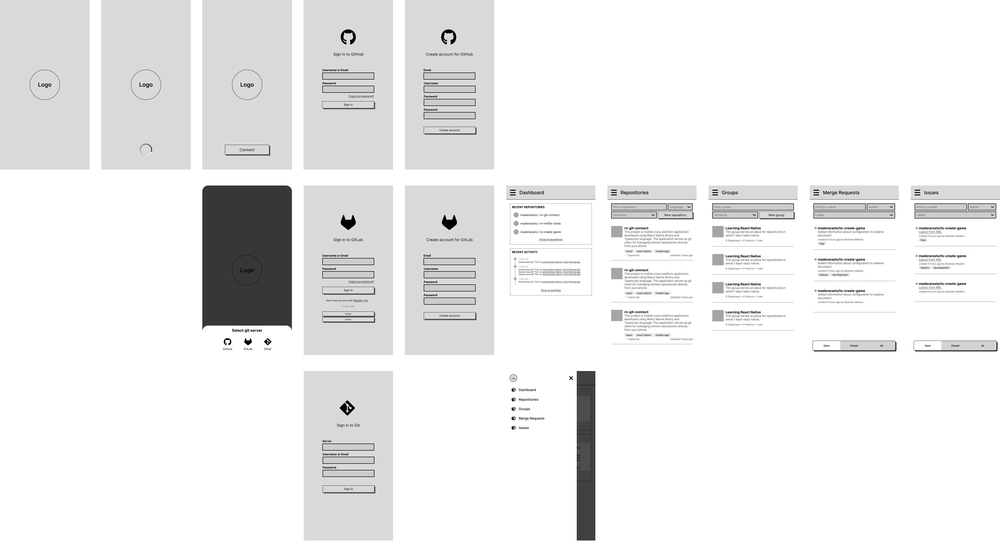
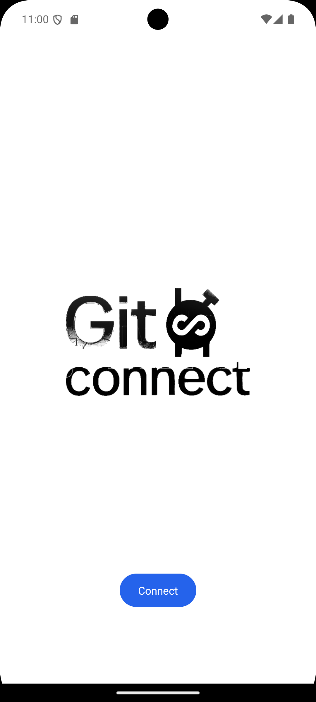
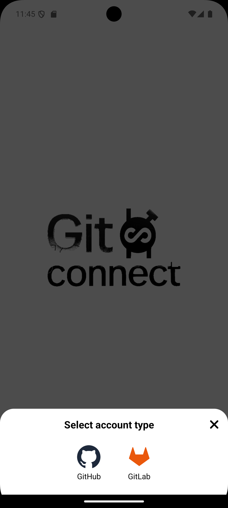
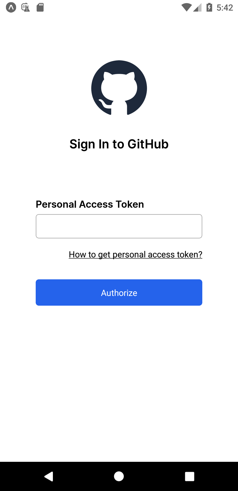
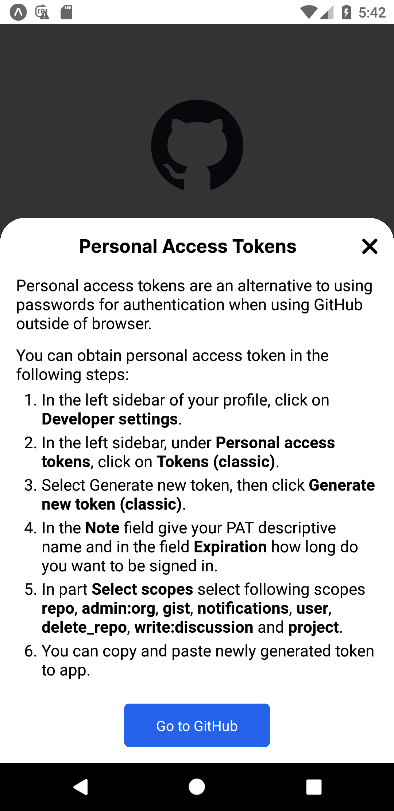
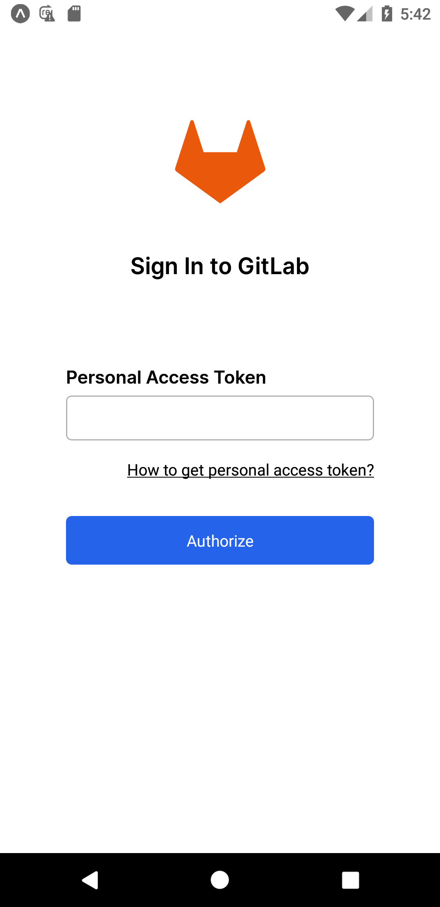

# RN Git Connect (react native app)
This project is mobile cross-platform application developed using **[React Native](https://reactnative.dev/)** library and **[Typescript](https://www.typescriptlang.org/)** language. The application serves as **[git](https://git-scm.com/)** client for managing remote repositories directly from your phone.

Tags: [React](https://react.dev/), [React Native](https://reactnative.dev/), [Typescript](https://www.typescriptlang.org/), [GitHub](https://github.com/), [GitLab](https://about.gitlab.com/), [Git](https://git-scm.com/)

## Motivation
An idea for this project was to easily maintain project repositories and also used react (native) and typescript skills on a real project.

## What is finished
:white_check_mark:&nbsp;&nbsp;Base version of wireframe design. 
:white_check_mark:&nbsp;&nbsp;Initialized a react native project with expo router. 
:white_check_mark:&nbsp;&nbsp;Splash screen with logo 
:white_check_mark:&nbsp;&nbsp;Entry screen with choosing git server. 

## Features to implement
:hourglass:&nbsp;&nbsp;Entry screen that redirects an user to sing in screen or dashboard 
:hourglass:&nbsp;&nbsp;SignIn screen for signing user to git server 
:hourglass:&nbsp;&nbsp;Register screen for creating an account for GitHub and GitLab 
:hourglass:&nbsp;&nbsp;Services for interacting with GitHub and GitLab 
:hourglass:&nbsp;&nbsp;Singing In with connections like Google or GitHub account (if possible) 

## Design

## Screenshots

    
    
    
    
    

