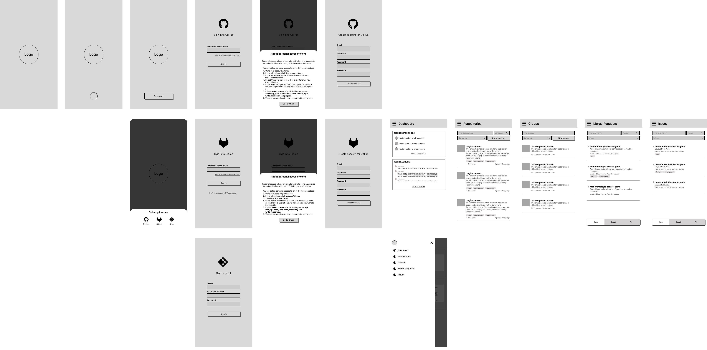
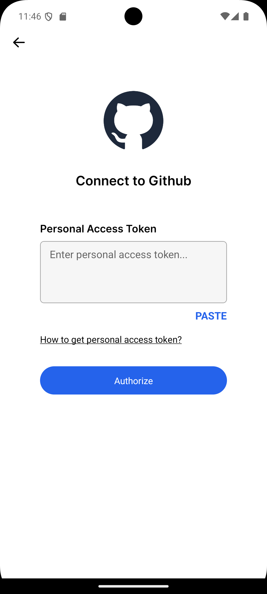
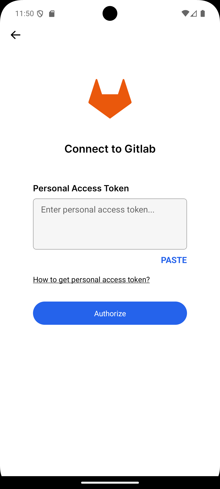
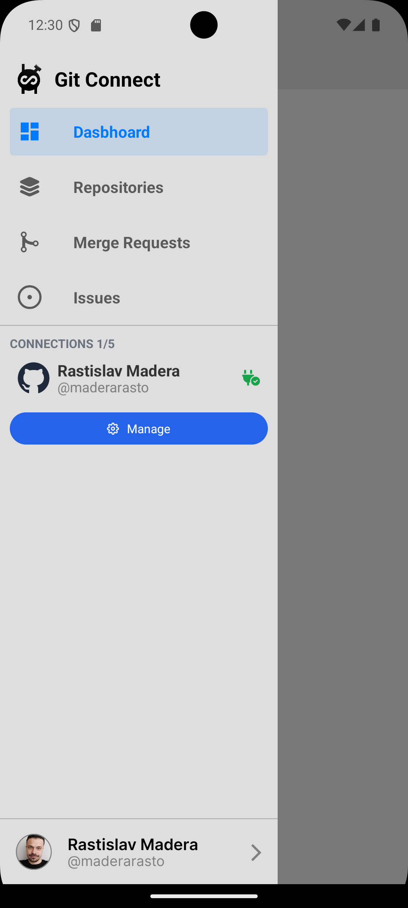
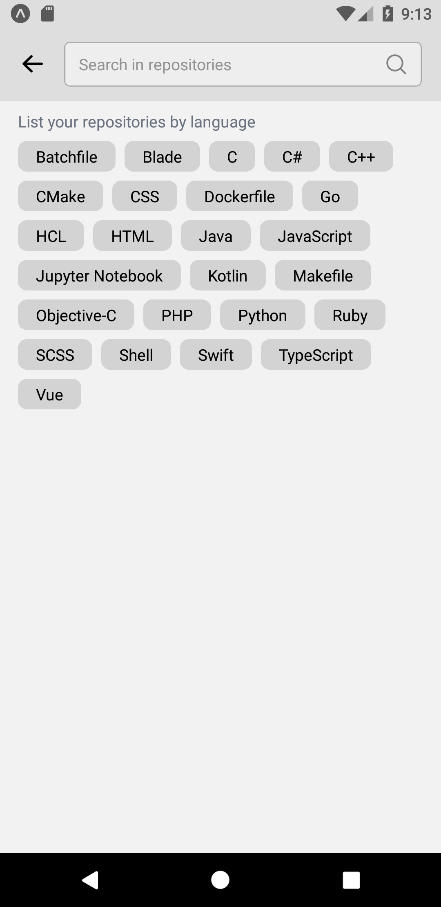
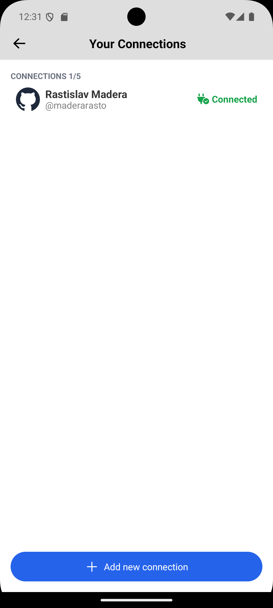

# Git Connect (react native app)
This project is mobile cross-platform application developed using **[React Native](https://reactnative.dev/)** library and **[Typescript](https://www.typescriptlang.org/)** language. The application serves as **[git](https://git-scm.com/)** client for managing remote repositories directly from your phone.

Tags: [React](https://react.dev/), [React Native](https://reactnative.dev/), [Typescript](https://www.typescriptlang.org/), [GitHub](https://github.com/), [GitLab](https://about.gitlab.com/), [Git](https://git-scm.com/)

## Motivation
An idea for this project was to easily maintain project repositories and also used react (native) and typescript skills on a real project.

## What I have learned
- Context API
- useQuery and useInfiniteQuery hooks
- React Native animations

## What is finished
:white_check_mark:&nbsp;&nbsp;Base version of wireframe design. 
:white_check_mark:&nbsp;&nbsp;Initialized a react native project with expo router. 
:white_check_mark:&nbsp;&nbsp;Splash screen with logo 
:white_check_mark:&nbsp;&nbsp;Entry screen with choosing git server. 
:white_check_mark:&nbsp;&nbsp;Entry screen that redirects an user to sing in screen or dashboard 
:white_check_mark:&nbsp;&nbsp;SignIn screen for signing user to github or gitlab 
:white_check_mark:&nbsp;&nbsp;Dashboard drawer for routing to another in-app screens. 
:white_check_mark:&nbsp;&nbsp;Managing your connections and switching between them. 
:white_check_mark:&nbsp;&nbsp;Services for interacting with GitHub and GitLab 
:white_check_mark:&nbsp;&nbsp;Access to profile and activity events of user 

## Features to implement
:hourglass:&nbsp;&nbsp;Editing user information in profile. 
:hourglass:&nbsp;&nbsp;Access to list of repositories. 
:hourglass:&nbsp;&nbsp;Access to list of merge requests. 
:hourglass:&nbsp;&nbsp;Access to list of issues. 
:hourglass:&nbsp;&nbsp;Dashboard screen for quick management. 

## Design

## Screenshots

    
    
    
    <!--  -->
    
    
    <!-- 
    
    
     -->
    
    
    
    
    

